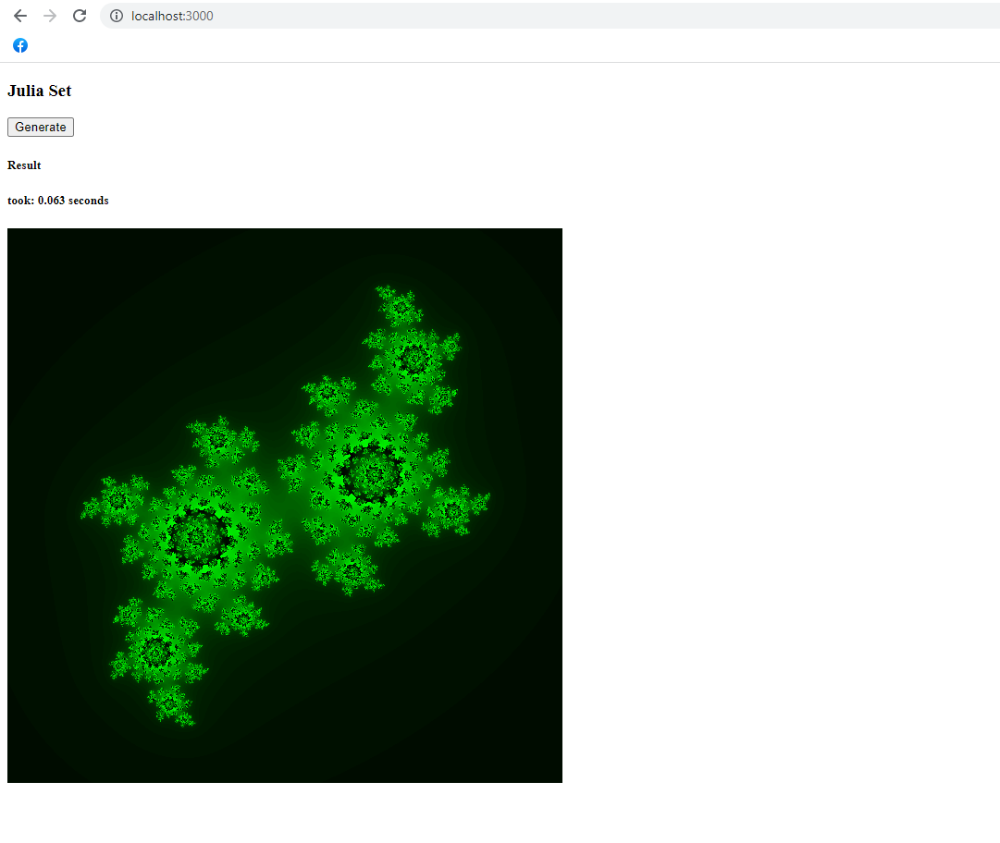
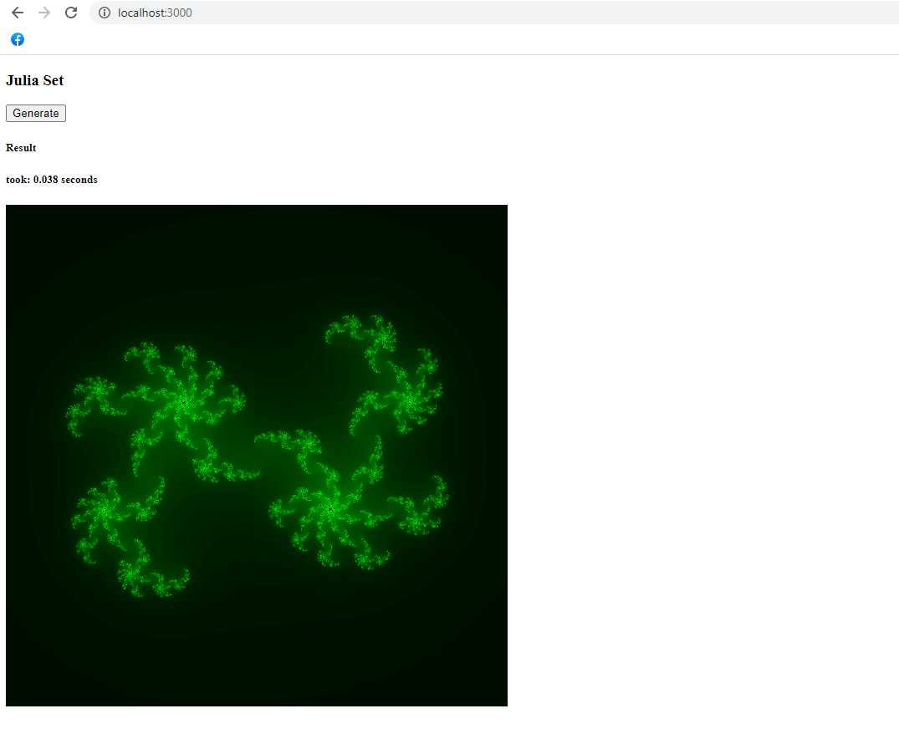

### Julia Set Random with Rust, Reactjs and WebAssembly 

Enter `webapp` folder
```shell
$ cd webapp/
```

Build Rust `drawx` wasm dependency
```shell
$ npm run build-drawx
```

Install `drawx` wasm dependency
```shell
$ npm install --save ../drawx/pkg/
```

Start `webapp`
```shell
$ npm start
```

#### Random Result
[](https://github.com/musobarlab)
<br/><br/>

[](https://github.com/musobarlab)
<br/><br/>